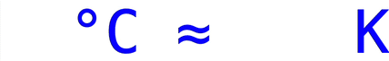

<a href="https://www.buymeacoffee.com/layflags" target="_blank"></a>

# &lt;layflags-rolling-number&gt;

This easy-to-use inline Web Component shows a nice rolling digit animation and automatically adapts to the surrounding font style.



**See a DEMO here: https://layflags.github.io/rolling-number/**

This project makes use of the latest browser features ([Web Components](https://developer.mozilla.org/en-US/docs/Web/Web_Components), [module scripts](https://developer.mozilla.org/en-US/docs/Web/JavaScript/Guide/Modules), [CSS variables](https://developer.mozilla.org/en-US/docs/Web/CSS/--*), etc.) which are well supported in current versions of [Google Chrome](https://www.google.com/chrome/), [Mozilla Firefox](https://www.mozilla.org/en-US/firefox/new/), [Apple Safari](https://www.apple.com/safari/) and [Microsoft Edge](https://www.microsoft.com/en-us/edge). If you need to target older browser versions or Microsoft Internet Explorer, you need to provide appropriate polyfills.

## Installation

### Self hosted

Add the following to an HTML document:

```html
<script type="module" src="path/to/rolling-number.js"></script>
```

### CDN

Add the following to an HTML document:

```html
<script
  type="module"
  src="https://unpkg.com/@layflags/rolling-number@1.0.0/rolling-number.js"
></script>
```

### [NPM](https://www.npmjs.com/package/@layflags/rolling-number)

Run `npm i @layflags/rolling-number`.

## Usage

```html
<!-- value by fallback -->
<layflags-rolling-number>123</layflags-rolling-number>

<!-- value w/o fallback -->
<layflags-rolling-number value="123"></layflags-rolling-number>

<!-- customize roll duration -->
<layflags-rolling-number
  style="--roll-duration:750ms"
  value="123"
></layflags-rolling-number>
```

## License

[MIT License](LICENSE)
